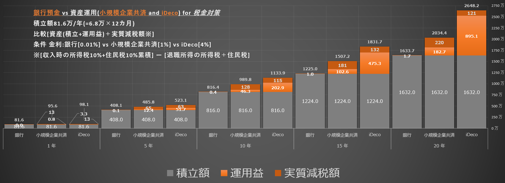
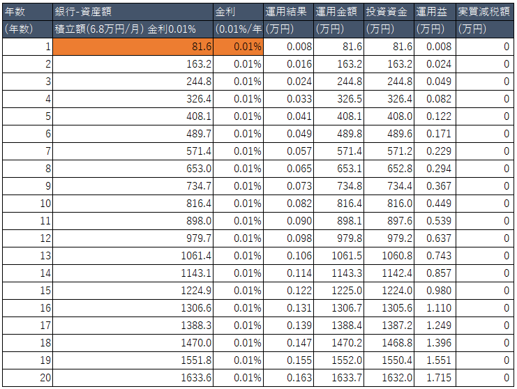
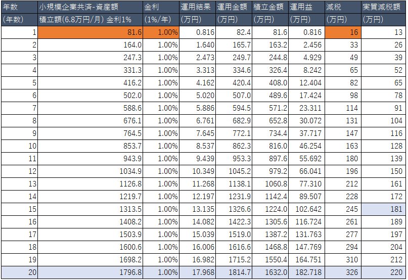
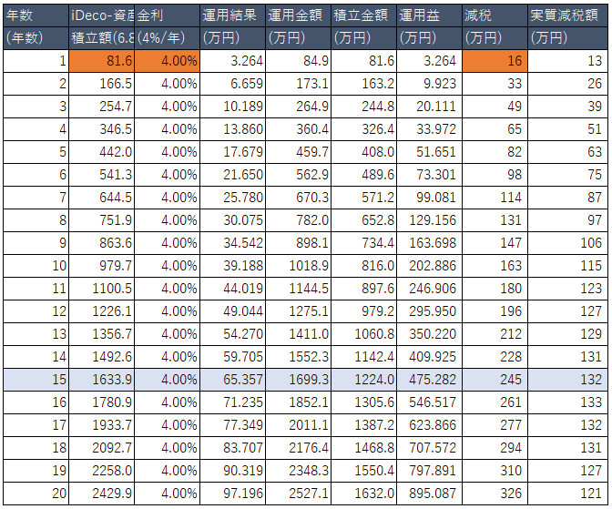

# 1. 資産運用（＋節税）for フリーランス

銀行預金、小規模企業共済、iDecoの3つで運用＋節税対策した場合、資産がどれだけ違うのか比較

|運用先  |金利  |積立額  |20年後積立+運用益+節税額|銀行との差|
|---------|---------|---------|---------|--|
|銀行     |0.01%         |81.6万(=6.8万*12ヶ月)         |1633万(≒1632+1.7+0)|0万|
|小規模企業共済     |1%         |81.6万(=6.8万*12ヶ月)   |2034万(≒1632+182.7+220)|+400万|
|iDeco     |4%         |81.6万(=6.8万*12ヶ月)           |2648万(≒1623+895.1+121)|**+1014万**|

---
## 1.1. 銀行預金

銀行預金する  
1年で`84万`積立する  
金利を`0.01%`とする  

<!-- 
|年数|銀行-資産額|金利|運用結果|運用金額|投資資金|運用益|実質減税額|
|--|--|--|--|--|--|--|--|
|(年数)|積立額(6.8万円/月) 金利0.01%|(0.01%/年)|(万円)|(万円)|(万円)|(万円)|(万円)|
|1|81.6|0.01%|0.008|81.6|81.6|0.008 |0 |
|2|163.2|0.01%|0.016|163.2|163.2|0.024 |0 |
|3|244.8|0.01%|0.024|244.8|244.8|0.049 |0 |
|4|326.4|0.01%|0.033|326.5|326.4|0.082 |0 |
|5|408.1|0.01%|0.041|408.1|408.0|0.122 |0 |
|6|489.7|0.01%|0.049|489.8|489.6|0.171 |0 |
|7|571.4|0.01%|0.057|571.4|571.2|0.229 |0 |
|8|653.0|0.01%|0.065|653.1|652.8|0.294 |0 |
|9|734.7|0.01%|0.073|734.8|734.4|0.367 |0 |
|10|816.4|0.01%|0.082|816.4|816.0|0.449 |0 |
|11|898.0|0.01%|0.090|898.1|897.6|0.539 |0 |
|12|979.7|0.01%|0.098|979.8|979.2|0.637 |0 |
|13|1061.4|0.01%|0.106|1061.5|1060.8|0.743 |0 |
|14|1143.1|0.01%|0.114|1143.3|1142.4|0.857 |0 |
|15|1224.9|0.01%|0.122|1225.0|1224.0|0.980 |0 |
|16|1306.6|0.01%|0.131|1306.7|1305.6|1.110 |0 |
|17|1388.3|0.01%|0.139|1388.4|1387.2|1.249 |0 |
|18|1470.0|0.01%|0.147|1470.2|1468.8|1.396 |0 |
|19|1551.8|0.01%|0.155|1552.0|1550.4|1.551 |0 |
|20|1633.6|0.01%|0.163|1633.7|1632.0|1.715 |0 | -->
---

## 1.2. 小規模企業共済

個人事業主の退職金として利用可能  
1年で最大`84万`まで積立可能  
積立お金は全額**所得税**、**住民税**の控除となる  
運用は約`1%`金利が付く  
※退職金として受取るときに退職職控除が適用されるが所得税、住民税がかかる。

note:
<!-- 
|年数|小規模企業共済-資産額|金利|運用結果|運用金額|積立金額|運用益|減税|実質減税額|
|--|--|--|--|--|--|--|--|--|
|(年数)|積立額(6.8万円/月) 金利1%|(1%/年)|(万円)|(万円)|(万円)|(万円)|(万円)|(万円)|
|1|81.6|1.00%|0.816|82.4|81.6|0.816 |16 |13 |
|2|164.0|1.00%|1.640|165.7|163.2|2.456 |33 |26 |
|3|247.3|1.00%|2.473|249.7|244.8|4.929 |49 |39 |
|4|331.3|1.00%|3.313|334.6|326.4|8.242 |65 |52 |
|5|416.2|1.00%|4.162|420.4|408.0|12.404 |82 |65 |
|6|502.0|1.00%|5.020|507.0|489.6|17.424 |98 |78 |
|7|588.6|1.00%|5.886|594.5|571.2|23.311 |114 |91 |
|8|676.1|1.00%|6.761|682.9|652.8|30.072 |131 |104 |
|9|764.5|1.00%|7.645|772.1|734.4|37.717 |147 |116 |
|10|853.7|1.00%|8.537|862.3|816.0|46.254 |163 |128 |
|11|943.9|1.00%|9.439|953.3|897.6|55.692 |180 |139 |
|12|1034.9|1.00%|10.349|1045.2|979.2|66.041 |196 |150 |
|13|1126.8|1.00%|11.268|1138.1|1060.8|77.310 |212 |161 |
|14|1219.7|1.00%|12.197|1231.9|1142.4|89.507 |228 |172 |
|15|1313.5|1.00%|13.135|1326.6|1224.0|102.642 |245 |181 |
|16|1408.2|1.00%|14.082|1422.3|1305.6|116.724 |261 |189 |
|17|1503.9|1.00%|15.039|1519.0|1387.2|131.763 |277 |197 |
|18|1600.6|1.00%|16.006|1616.6|1468.8|147.769 |294 |204 |
|19|1698.2|1.00%|16.982|1715.2|1550.4|164.751 |310 |212 |
|20|1796.8|1.00%|17.968|1814.7|1632.0|182.718 |326 |220 | -->
---

## 1.3. iDeco

個人事業主の退職金として利用可能  
1年で最大`81.6万`まで積立可能  
積立お金は全額**所得税**、**住民税**の控除となる  
運用商品は自分で選択する。  
年利約`4%`金利とする。  
※過去の実績から十分に可能な金利である。  
※退職金として受取るときに退職職控除が適用されるが**所得税、住民税がかかる**。

  

note:
<!--
|年数|iDeco-資産額|金利|運用結果|運用金額|積立金額|運用益|減税|実質減税額|
|--|--|--|--|--|--|--|--|--|
|(年数)|積立額(6.8万円/月) 金利4%|(4%/年)|(万円)|(万円)|(万円)|(万円)|(万円)|(万円)|
|1|81.6|4.00%|3.264|84.9|81.6|3.264 |16 |13.2|
|2|166.5|4.00%|6.659|173.1|163.2|9.923 |33 |26.1552|
|3|254.7|4.00%|10.189|264.9|244.8|20.111 |49 |38.85581|
|4|346.5|4.00%|13.860|360.4|326.4|33.972 |65 |51.29164|
|5|442.0|4.00%|17.679|459.7|408.0|51.651 |82 |63.45211|
|6|541.3|4.00%|21.650|562.9|489.6|73.301 |98 |75.32619|
|7|644.5|4.00%|25.780|670.3|571.2|99.081 |114 |86.90244|
|8|751.9|4.00%|30.075|782.0|652.8|129.156 |131 |97.12191|
|9|863.6|4.00%|34.542|898.1|734.4|163.698 |147 |106.2744|
|10|979.7|4.00%|39.188|1018.9|816.0|202.886 |163 |114.9802|
|11|1100.5|4.00%|44.019|1144.5|897.6|246.906 |180 |123.1971|
|12|1226.1|4.00%|49.044|1275.1|979.2|295.950 |196 |126.6741|
|13|1356.7|4.00%|54.270|1411.0|1060.8|350.220 |212 |129.3975|
|14|1492.6|4.00%|59.705|1552.3|1142.4|409.925 |228 |131.337|
|15|1633.9|4.00%|65.357|1699.3|1224.0|475.282 |245 |132.4613|
|16|1780.9|4.00%|71.235|1852.1|1305.6|546.517 |261 |132.7377|
|17|1933.7|4.00%|77.349|2011.1|1387.2|623.866 |277 |132.1324|
|18|2092.7|4.00%|83.707|2176.4|1468.8|707.572 |294 |130.6101|
|19|2258.0|4.00%|90.319|2348.3|1550.4|797.891 |310 |126.5146|
|20|2429.9|4.00%|97.196|2527.1|1632.0|895.087 |326 |121.068| -->
---

## 1.4. 退職所得控除

小規模企業共済、iDecoで積立年数に応じて、控除金額が確定する。  
例1）20年積立場合、800万が控除となる。  
　　小規模企業共済の受取金額：1796.8万（計算を簡単にするため1800万とする）  
　　1800万 - 800万≒1000万/2=500万が課税所得となる。  
　　所得税：500万×20% - 42.75 = 57.25万  
　　住民税：500万×10% = 50万  
　　所得税＋住民税＝`100.25万`が受取時に税金として納める。

例2）20年積立場合、800万が控除となる。  
　　iDecoの受取金額：2429.9万（計算を簡単にするため2429万とする）  
　　2429万 - 800万≒1629万/2≒814万が課税所得となる。  
　　所得税：814万×23% - 63.6 ≒ 123.7万  
　　住民税：814万×10% = 81.4万  
　　所得税＋住民税＝`205.135万`が受取時に税金として納める。  
　　毎年減税されていたが退職金で受取るときに減税効果が落ちる。  
　　326万→(326万 ― 205万≒)121万が実質減税額になる  
　　※これは短期に高額を積立結果で、長期で40万ずつ積み立てると税金がかからない。  
　　　減税効果を受取ってもキープできる。

---

### 1.4.1 退職所得控除計算
|積立年数|退職所得控除額|
|:----|:----|
|20年以下|40万円×積立年数(80万円に満たない場合には、80万円)|
|20年超|800万円＋70万円×（積立年数-20年）|

---

### 1.4.2 所得税

|課税される所得金額|税率|控除額|
|:----|:----|:----|
|1000円から1,949,000円まで|5％|0円|
|1,950,000円から3,299,000円まで|10%|97,500円|
|3,300,000円から6,949,000円まで|20%|427,500円|
|6,950,000円から8,999000円まで|23%|636,000円|
|9,000,000円から17,999000円まで|33%|1,536,000円|
|18,000,000円から39,999000円まで|40%|2,796,000円|
|40,000,000円 以上|45%|4796000円|
